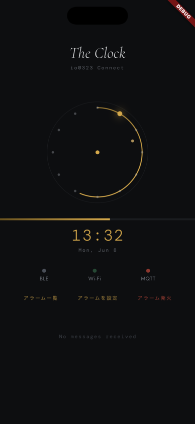
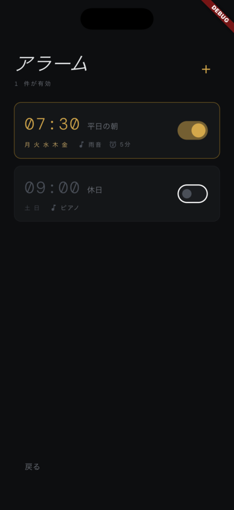
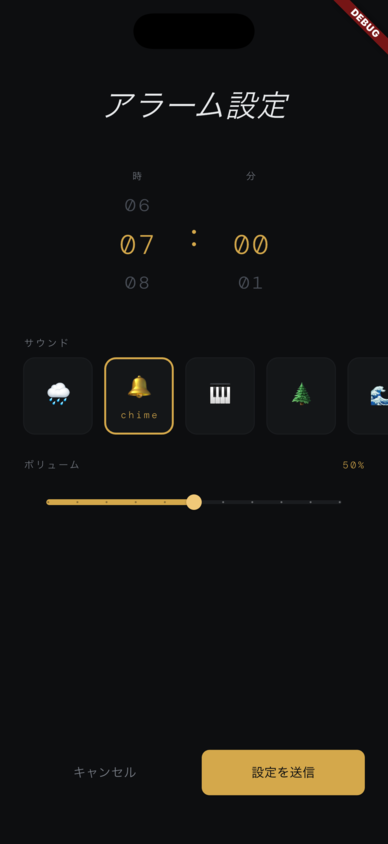
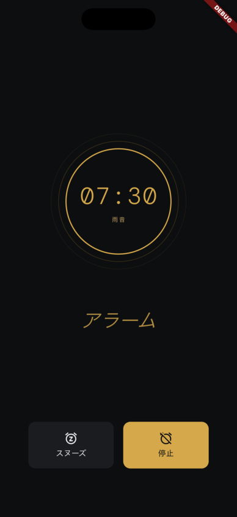

# The Clock App — Connect 再設計


> 「The Clock」向け Flutter ポートフォリオアプリ。
> BLE通信・MQTT/クラウド連携・非同期状態管理を横断した設計が中核。

## スクリーンショット

| ホーム画面 | アラーム一覧 | アラーム編集 | 発火画面 |
|:---------:|:-----------:|:-----------:|:-------:|
|  |  |  |  |

---

## 技術スタック

| カテゴリ | 技術 |
|---------|------|
| フレームワーク | Flutter 3.x / Dart 3.x |
| 状態管理 | Riverpod 2.x（StateNotifier / StreamProvider） |
| BLE通信 | flutter_blue_plus |
| クラウド連携 | MQTT（mqtt_client）/ REST API（Dio + Retrofit） |
| 通知 | flutter_local_notifications |
| 永続化 | SharedPreferences |
| テスト | flutter_test / mocktail |
| CI | GitHub Actions |

---

## アーキテクチャ

Clean Architecture（3層分離）を採用しています。

```
┌─────────────────────────────────────────────────────┐
│                  Presentation                       │
│   Screens ─── Widgets ─── Riverpod Providers        │
├─────────────────────────────────────────────────────┤
│                    Domain                           │
│   Entities ─── UseCases ─── Repository Interfaces   │
├─────────────────────────────────────────────────────┤
│                     Data                            │
│   Repository Impl ─── DataSources (BLE/MQTT/REST)   │
└─────────────────────────────────────────────────────┘
```

**依存方向**: Presentation → Domain ← Data（Domain は外部に依存しない）

### ディレクトリ構成

```text
lib/
├── core/                   # 共通ユーティリティ・定数・例外定義
│   ├── constants/          #   AppColors, AppTextStyles, AppTheme, MqttTopics
│   ├── errors/             #   AppException, BleException, MqttException, AlarmException
│   └── utils/              #   BleLogger, DemoData
│
├── domain/                 # ビジネスロジック層
│   ├── entities/           #   ClockState, BleDevice, SensorData, AlarmConfig 等
│   ├── repositories/       #   BleRepository, MqttRepository, ClockRepository（interface）
│   └── usecases/
│       ├── ble/            #   ScanDevices, ConnectDevice, AutoReconnect
│       └── mqtt/           #   WatchSensor, ConnectMqtt, SyncDeviceShadow, PublishAlarm
│
├── data/                   # データアクセス層
│   ├── datasources/        #   BleDataSource, MqttDataSource, RestDataSource
│   └── repositories/       #   BleRepositoryImpl, MqttRepositoryImpl, MockClockRepository
│
├── presentation/           # UI 層
│   ├── providers/          #   ble_provider, mqtt_provider, clock_provider, ble_lifecycle_provider
│   ├── screens/            #   home/, scan/, alarm/
│   └── widgets/            #   clock_face/, light_hour_bar/, mqtt/, sensor/, status_bar/
│
└── main.dart
```

---

## 設計の要点

### BLE 接続状態機械

```
Idle → Scanning → Connecting → Auth → Ready
                                 ↓
                  Error → [指数バックオフ] → Scanning
```

再接続は指数バックオフ（1s → 2s → 4s → 8s → 16s → 最大30s）で最大5回リトライします。

- `BleRepository`（interface）→ `BleRepositoryImpl`（実装）で責務を分離
- 接続状態は `StateNotifierProvider` で一元管理し、UI は `ref.watch()` で反映
- 全 BLE 操作を `try/catch (BleException)` でラップし、エラーを統一的にハンドリング

### MQTT リアルタイム同期

```
Device ──publish──▶ Broker ──subscribe──▶ App
App    ──publish──▶ Broker ──subscribe──▶ Device
```

- `StreamProvider` で MQTT メッセージを購読し、センサーデータをリアルタイム反映
- Device Shadow パターンでオフライン時の状態差分を同期
- トピック設計は `core/constants/mqtt_topics.dart` に集約

#### MQTTトピック設計

| 方向 | トピック | 用途 |
|-----|---------|------|
| Sub | `io0323/{deviceId}/alarm` | アラーム発火イベント受信 |
| Sub | `io0323/{deviceId}/sensor` | 温湿度センサーデータ |
| Sub | `io0323/{deviceId}/shadow/get/accepted` | デバイスシャドウ取得 |
| Pub | `io0323/{deviceId}/alarm/set` | アラーム設定送信 |
| Pub | `io0323/{deviceId}/shadow/update` | シャドウ更新 |

### アラーム管理

- Domain Entity（`AlarmConfig`）→ UseCase（`PublishAlarmUsecase`）→ MQTT publish の流れ
- アラーム発火時のバイブレーション・サウンドは OS ネイティブ通知と連携

---

## 実装のポイント（採用要件との対応）

### 非同期処理・状態管理の設計（MUST）
- Riverpod の `StateNotifierProvider` で BLE・アラームの状態を厳密に管理
- 接続中に再接続処理が走らないよう `BleConnectionStatus` で排他制御
- 通信失敗時の自動リトライを `AutoReconnectUseCase` に集約

### BLE / IoTデバイス連携開発（WANT）
- `flutter_blue_plus` でスキャン・ペアリング・再接続・状態同期を実装
- iOS / Android の BLE パーミッション差異・バックグラウンド挙動の違いを吸収

### MQTT / クラウド連携（WANT）
- `mqtt_client` で AWS IoT Core 互換のリアルタイム通信を実装
- デバイスシャドウ（REST API / MQTT の二段階フォールバック）

### 通信トラブル時のリカバリ設計（WANT）
- 指数バックオフによる自動再接続（BLE / MQTT 両方）
- タイムアウト検知・切断リカバリフローを UseCase に実装

### ログをもとに不具合を特定する力（WANT）
- `BleLogger` で接続イベントを構造化ログ出力
- アプリ側 / 通信側 / デバイス側の問題を3段階で切り分け可能

---

## セットアップ

### 必要環境
- Flutter 3.x 以上
- Dart 3.x 以上
- Android Studio / Xcode

### インストール
```bash
git clone https://github.com/io0323/the-clock-app.git
cd the-clock-app
cp .env.example .env   # 環境変数を設定
flutter pub get
flutter run
```

### ローカルMQTTブローカー（開発用）
```bash
brew install mosquitto
brew services start mosquitto
# .env の MQTT_HOST=localhost を確認
```

---

## テスト

```bash
flutter test                    # 全テスト実行
flutter test --coverage         # カバレッジ計測
flutter analyze                 # 静的解析
```

| レイヤー | テスト手法 | ツール |
|---------|-----------|-------|
| Domain（UseCase） | ユニットテスト | flutter_test / mocktail |
| Data（Repository） | ユニットテスト + Mock | mocktail |
| BLE / MQTT 結合 | 統合テスト（実機） | flutter_test |
| Presentation | Widget テスト | flutter_test |

---

## ディレクトリ構成（詳細）

```text
lib/
├── core
│   ├── constants
│   │   ├── app_colors.dart
│   │   ├── app_text_styles.dart
│   │   ├── app_theme.dart
│   │   ├── env.dart
│   │   └── mqtt_topics.dart
│   ├── errors
│   │   ├── alarm_exception.dart
│   │   ├── app_exception.dart
│   │   ├── ble_exception.dart
│   │   └── mqtt_exception.dart
│   └── utils
│       ├── ble_logger.dart
│       └── demo_data.dart
├── data
│   ├── datasources
│   │   ├── ble_datasource.dart
│   │   ├── mqtt_datasource.dart
│   │   └── rest_datasource.dart
│   └── repositories
│       ├── ble_repository_impl.dart
│       ├── mock_clock_repository.dart
│       └── mqtt_repository_impl.dart
├── domain
│   ├── entities
│   │   ├── alarm_config.dart
│   │   ├── alarm_sound.dart
│   │   ├── alarm_trigger_event.dart
│   │   ├── alarm_weekday.dart
│   │   ├── ble_connection_state.dart
│   │   ├── ble_connection_status.dart
│   │   ├── ble_device.dart
│   │   ├── brightness_level.dart
│   │   ├── clock_state.dart
│   │   ├── device_shadow.dart
│   │   ├── mqtt_message.dart
│   │   └── sensor_data.dart
│   ├── repositories
│   │   ├── ble_repository.dart
│   │   ├── clock_repository.dart
│   │   └── mqtt_repository.dart
│   └── usecases
│       ├── ble
│       │   ├── auto_reconnect_usecase.dart
│       │   ├── connect_device_usecase.dart
│       │   └── scan_devices_usecase.dart
│       └── mqtt
│           ├── connect_mqtt_usecase.dart
│           ├── publish_alarm_usecase.dart
│           ├── sync_device_shadow_usecase.dart
│           └── watch_sensor_usecase.dart
├── main.dart
└── presentation
    ├── providers
    │   ├── ble_lifecycle_provider.dart
    │   ├── ble_provider.dart
    │   ├── clock_provider.dart
    │   └── mqtt_provider.dart
    ├── screens
    │   ├── alarm
    │   │   ├── alarm_firing_screen.dart
    │   │   ├── alarm_list_screen.dart
    │   │   ├── alarm_set_screen.dart
    │   │   └── widgets
    │   │       ├── sound_selector_widget.dart
    │   │       ├── time_picker_widget.dart
    │   │       ├── volume_slider_widget.dart
    │   │       └── weekday_picker_widget.dart
    │   ├── home
    │   │   └── home_screen.dart
    │   └── scan
    │       └── scan_screen.dart
    └── widgets
        ├── ble_error_banner.dart
        ├── clock_face
        │   ├── clock_face_widget.dart
        │   └── light_hour_painter.dart
        ├── light_hour_bar
        │   └── light_hour_bar_widget.dart
        ├── mqtt
        │   ├── message_feed_widget.dart
        │   └── mqtt_status_widget.dart
        ├── scan
        │   ├── device_list_tile.dart
        │   └── scan_animation_widget.dart
        ├── sensor
        │   └── sensor_card_widget.dart
        └── status_bar
            ├── connection_status_dot.dart
            └── status_bar_widget.dart

28 directories, 64 files
```

---

## コミット規約

[Conventional Commits](https://www.conventionalcommits.org/) に準拠しています。

```
feat:     新機能
fix:      バグ修正
refactor: リファクタリング
test:     テスト追加・修正
docs:     ドキュメント
```

---

## ロードマップ

- [x] Clean Architecture の土台構築
- [x] Riverpod 導入・Provider 設計
- [x] BLE 接続フロー実装（スキャン → 接続 → ライフサイクル管理）
- [x] MQTT 連携（リアルタイム同期・センサーデータ購読）
- [x] REST API 連携（Dio + Retrofit）
- [x] アラーム管理（ドメイン設計 → MQTT publish）
- [x] アプリアイコン・スプラッシュ画面
- [ ] flutter_local_notifications によるアラーム発火
- [ ] SharedPreferences によるアラーム永続化
- [ ] GitHub Actions CI パイプライン
- [ ] E2E テスト整備

---

## ライセンス

MIT
